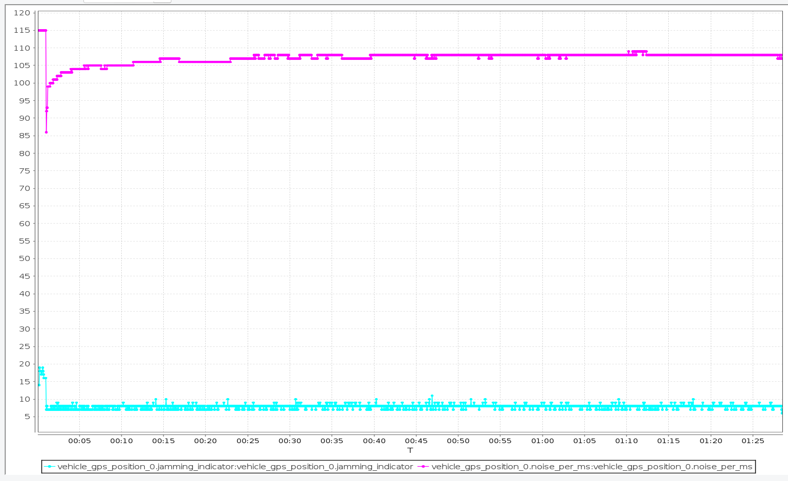

## 静态测试

### M9_902

>**第一次**
>

>**第二次**
>

>**第三次**
>

>**第四次**
>

>**第五次**
>

### M8Q

>**第一次**
>

>**第二次**
>

>**第三次**
>

>**第四次**
>

### **总结:**
新M9_902除了**eph/epv**稳定度比M8Q高一些(实际lat/lon波动区别不大)，**干扰**及**vel_d_ms**稳定效果都比M8Q差很多。
可以排除此模块
