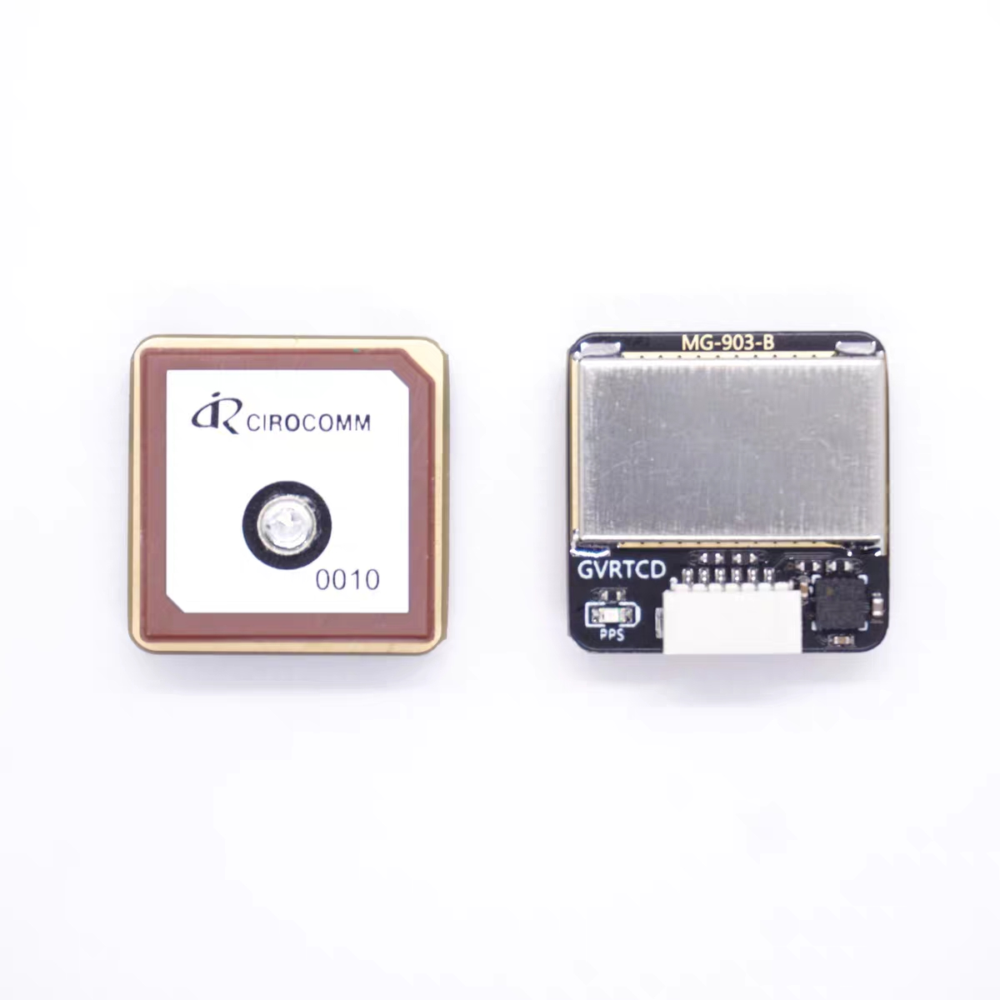
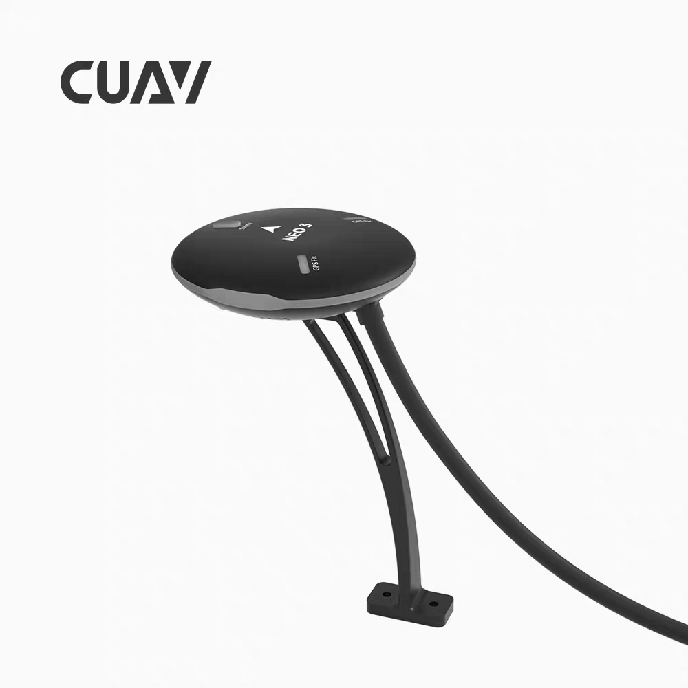
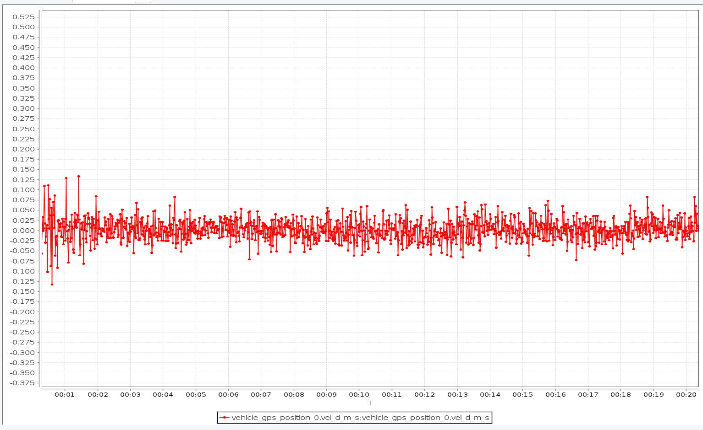

#### 选型M9 GPS模块
 

>静态测试(`d_vel_ms`数据)

#### CUAV GPS模块(也是Ublox的M9)
 

>静态测试(`d_vel_ms`数据)

可以得出**并非ublox m9方案问题**，问题在**天线及PCB外围设计**，也佐证了选型的GPS模块本是应用在穿越机及固定翼FPV这些定位精度及抗干扰要求不高却对小型化有需求的场景，设计之初并没考虑这些性能指标。