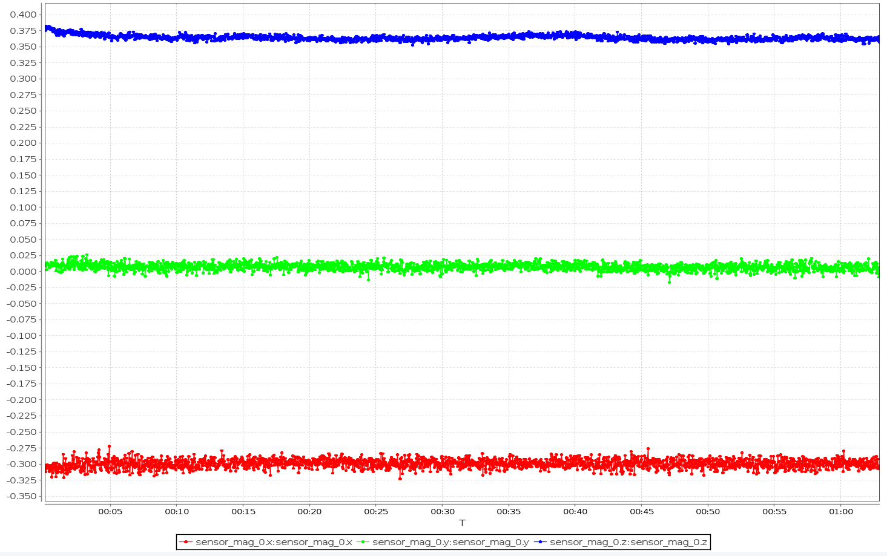
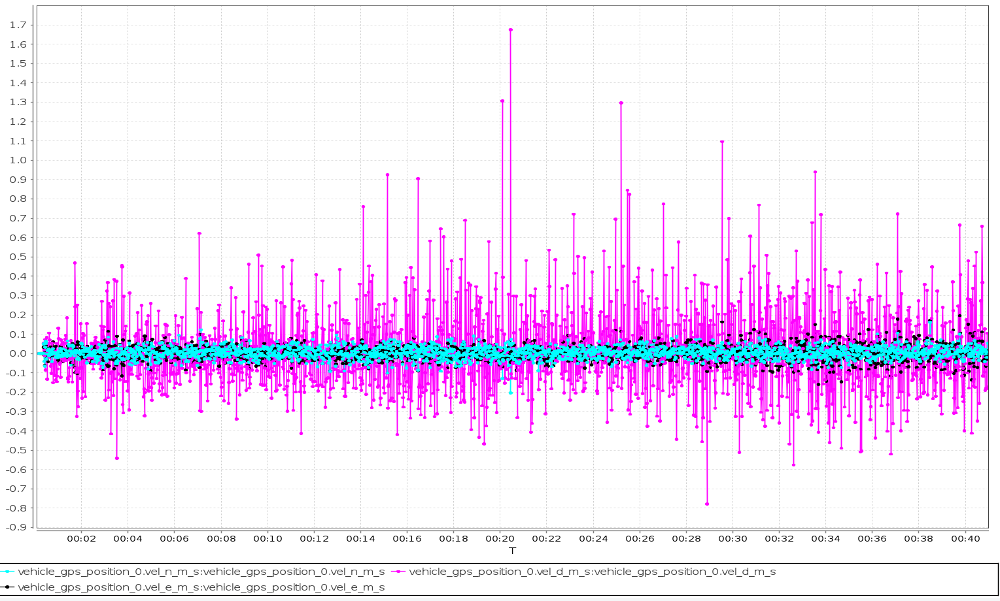

****
## qmc5883l磁力计

### qmc5883模块1
校准参数 | 比例
-|-
`CAL_MAG0_XOFF` | `0.31656072` |
`CAL_MAG0_XSCALE` | `1.0077323` |
`CAL_MAG0_YOFF` | `-0.06867772` |
`CAL_MAG0_YSCALE` | `0.99088943` |
`CAL_MAG0_ZOFF` | `0.021041712` |
`CAL_MAG0_ZSCALE` | `0.9995325` |

>1小时静置原始数据

最大波动0.02左右

### qmc5883模块2
校准参数 | 比例
-|-
`CAL_MAG0_XOFF`|	`0.21131277`
`CAL_MAG0_XSCALE`	|`1.0047152`
`CAL_MAG0_YOFF`|	`0.22278698`
`CAL_MAG0_YSCALE`|	`0.9862728`
`CAL_MAG0_ZOFF`|	`0.15840615`
`CAL_MAG0_ZSCALE`|	`1.0074145`

>1小时静置原始数据

### 原IST8310模块

最大波动0.01左右

良好，可用。与原模块差距不大
****
## M9 GPS

## 静态测试

### **单独`vel_d_m_s`:**

#### M9 GPS模块1
>第一次静态测试

>第二次静态测试

#### M9 GPS模块2
>第一次静态测试

#### **原M8Q GPS**静态测试

显然，M9在D轴上的速度**波动过大**。

### **三轴`vel_n_m_s,vel_e_m_s,vel_d_m_s`:**

#### M9 GPS模块1
>第一次静态测试

>第二次静态测试

#### M9 GPS模块2
>第一次静态测试

#### **原M8Q GPS**静态测试

`vel_n_m_s,vel_e_m_s,vel_d_m_s`对比，M9相比原M8Q
d轴**波动明显**,NE轴相差不大，**对飞机定高扰动明显，水平定位差距不大**。

## 悬停测试

#### M9 GPS模块1

>20m高度悬停10min

>10m高度悬停10min

>3m高度悬停10min

#### M9 GPS模块2

新M9模块D轴速度波动**越靠近地面，波动越剧烈**

#### **原M8Q GPS**近地面悬停

地面干扰对M9 `d_vel_ms` 影响较大，对M8Q影响小。
