## 地面静置

### **Mantis_G M8Q**
>**eph/epv位置精度**
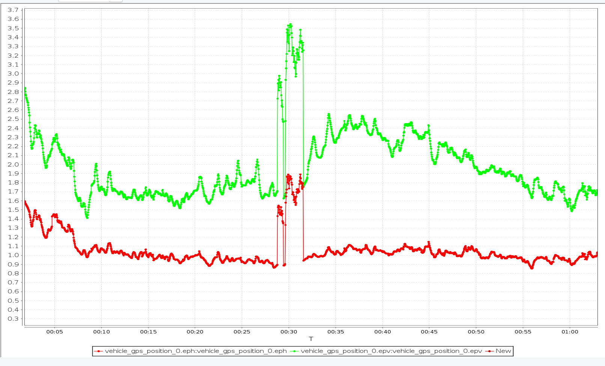
>>**导致gps高度，经度变化巨大**
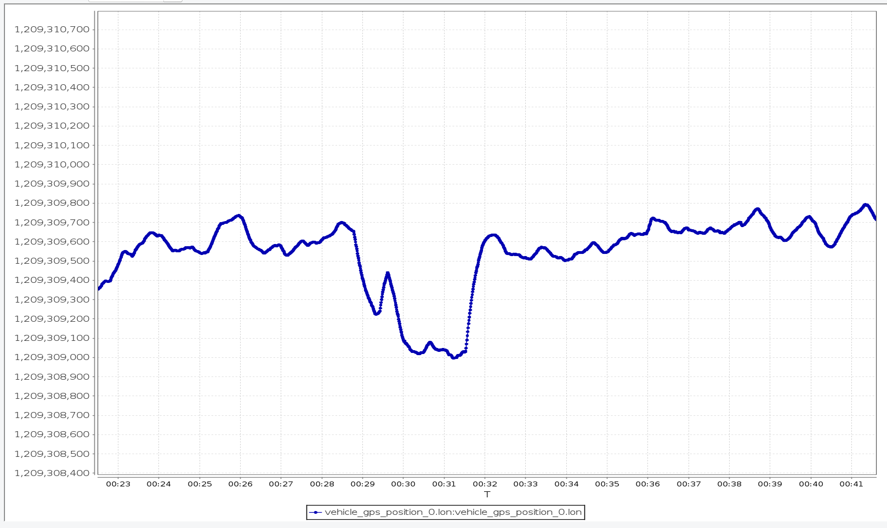 
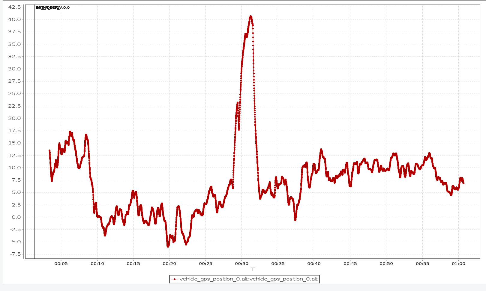
**vel_d_m_s速度波动**
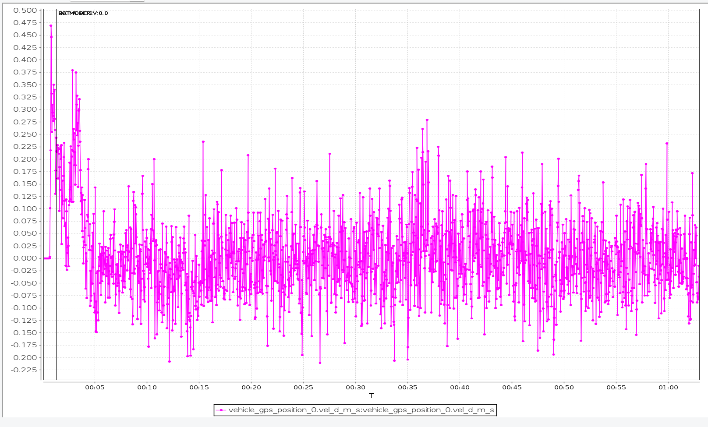
**信号干扰noise_per_ms/jamming_indicator**
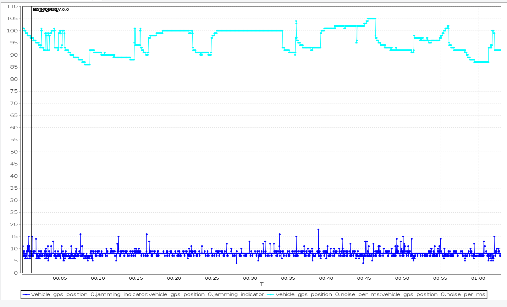

****

### **H850 M8Q**
>**eph/epv位置精度**
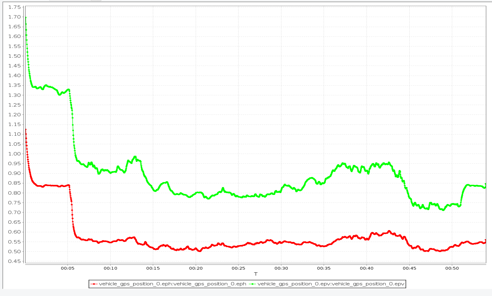
**vel_d_m_s速度波动**
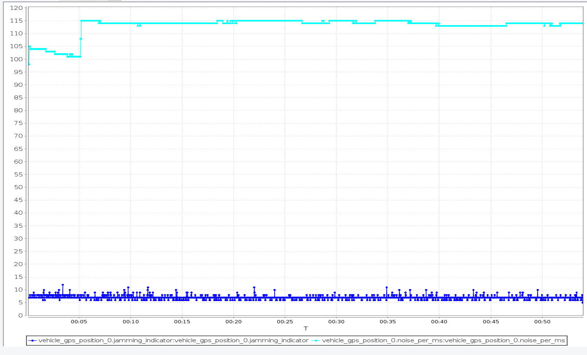
**信号干扰noise_per_ms/jamming_indicator**
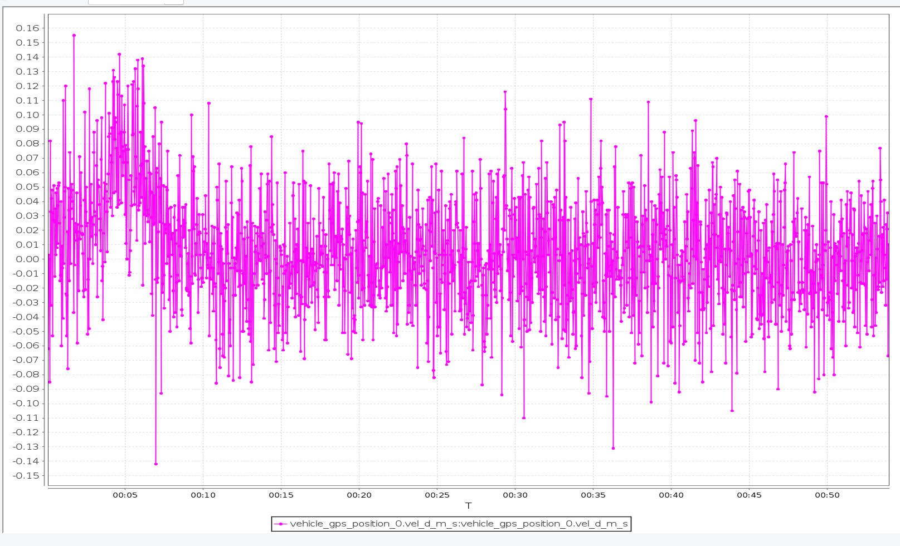

****

### **新 M9模块**
>**eph/epv位置精度**
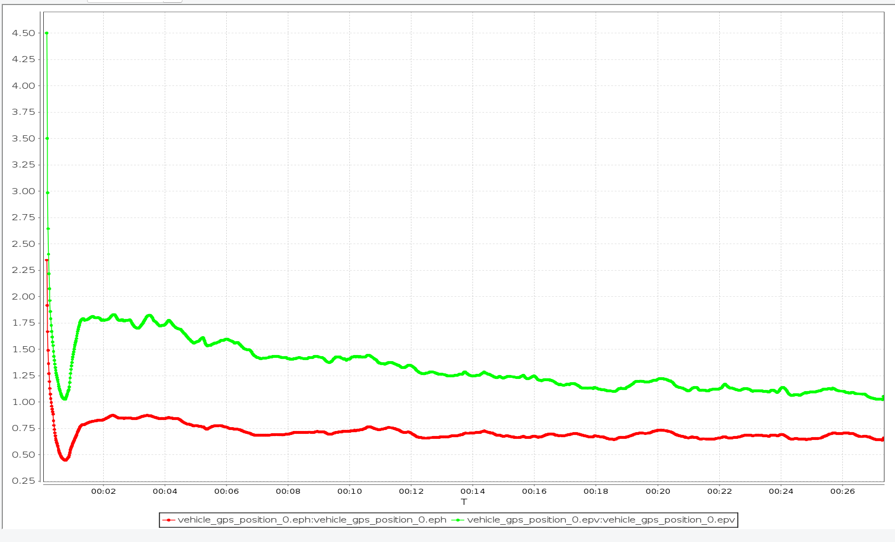
**vel_d_m_s速度波动**
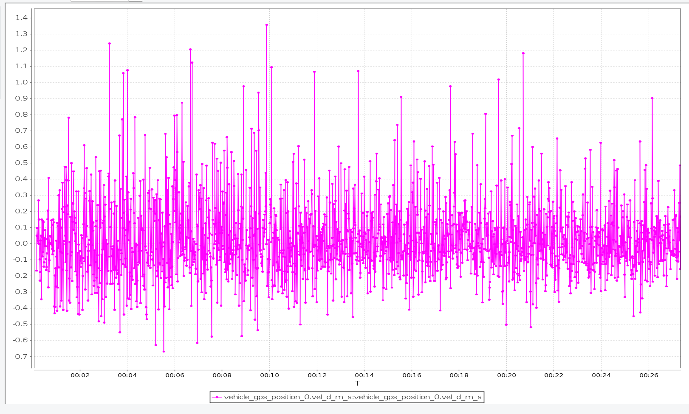
**信号干扰noise_per_ms/jamming_indicator**
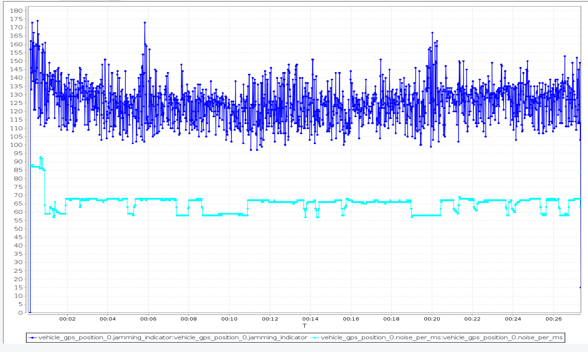

## 总结：
上述对比可得Mantis_G M8Q模块整体比H850 M8Q略差，特别是位置精度存在大波动，但要整体比新 M9模块表现好，Mantis_G M8Q模块vel_d_m_s速度波动对飞机定高稳定度影响不大。

模块 | eph/epv位置精度 | vel_d_m_s速度波动 | 信号干扰noise_per_ms/jamming_indicator
:-:|:-:|:-:|:-:
Mantis_G M8Q | :heavy_check_mark::heavy_check_mark: | :heavy_check_mark::heavy_check_mark::heavy_check_mark::heavy_check_mark: | :heavy_check_mark::heavy_check_mark::heavy_check_mark::heavy_check_mark::heavy_check_mark:
H850 M8Q | :heavy_check_mark::heavy_check_mark::heavy_check_mark::heavy_check_mark::heavy_check_mark: | :heavy_check_mark::heavy_check_mark::heavy_check_mark::heavy_check_mark::heavy_check_mark: | :heavy_check_mark::heavy_check_mark::heavy_check_mark::heavy_check_mark::heavy_check_mark:
新 M9模块 | :heavy_check_mark::heavy_check_mark::heavy_check_mark::heavy_check_mark: | :heavy_check_mark: | :heavy_check_mark:

