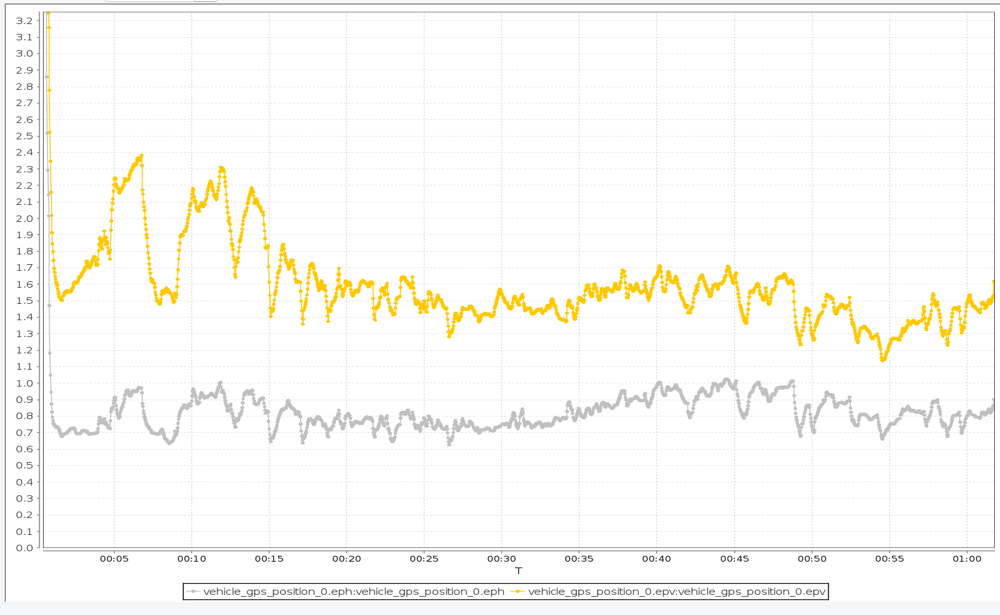

## 多次静态测试
#### 第一次静态2h
>**eph/epv**

**vel_d_ms**

**lat**

**lon**

**alt**

#### 第一次静态20min
>**eph/epv**

**vel_d_ms**

**lat**

**lon**

**alt**

## 2023-11-1测试
### 第一次静态
>**eph/epv**

**lat**

**lon**

**alt**

**jamming/noise**

**vel_d_ms**

### 第二次静态
>**eph/epv**

**lat**

**lon**

**alt**

**jamming/noise**

**vel_d_ms**

### 第三次静态
>**eph/epv**

**lat**

**lon**

**alt**

**jamming/noise**

**vel_d_ms**

### 第四次静态
>**eph/epv**

**lat**

**lon**

**alt**

**jamming/noise**

**vel_d_ms**
